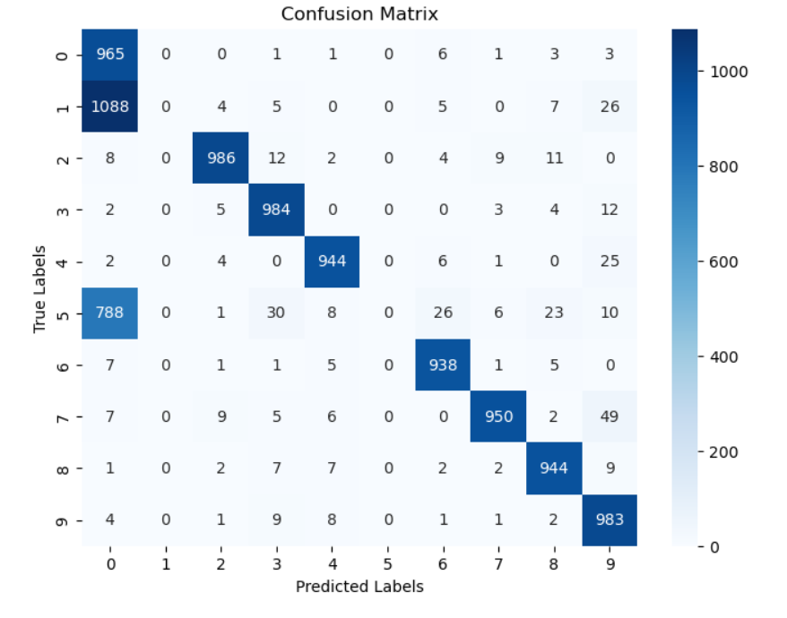

# PyTorch Deep Learning Projects 🧠🔥

*(Confusion Matrix from the Handwritten Digits Classification Project)*

PyTorch Deep Learning Projects 🧠🔥(Confusion Matrix visualization from the Handwritten Digits Classification Project)📌 Repository OverviewThis repository contains a collection of foundational deep learning projects built using the PyTorch framework.These projects are designed to serve as a practical introduction to the building blocks of AI. They bridge the gap between traditional machine learning and deep learning by covering essential workflows: starting from manual data handling and linear regression implemented as a neural network, moving to data engineering pipelines, and finally building full Multilayer Perceptrons (MLPs) for computer vision tasks.📂 Project List1. Employee Bonus Predictor 💰File: bonus_prediction_nn.ipynbDataset: bonus.csv (Custom dataset included in repo)Type: Regression / Single-Layer Neural NetworkProject Detail:This project explores how Linear Regression—the cornerstone of statistical learning—can be implemented using the architecture of a Neural Network. Instead of using high-level tools like Scikit-Learn, we build a PyTorch model from scratch to predict a continuous financial value.The Problem: Companies need a fair, mathematical way to determine employee bonuses based on merit.The Logic: The model processes three distinct input features:Performance Rating (1-10 scale)Years of ExperienceProjects CompletedIt learns specific "weights" (importance) for each feature and a "bias" (base bonus) to calculate the final amount.Architecture: A single fully connected layer (nn.Linear) that maps 3 inputs to 1 output.Key Learning Outcomes:Converting raw Pandas DataFrames into floating-point PyTorch Tensors.Understanding the Mean Squared Error (MSE) loss function for regression tasks.Implementing the full training loop manually: Forward Pass $\rightarrow$ Calculate Loss $\rightarrow$ Backpropagation $\rightarrow$ Optimizer Step (SGD).2. Handwritten Digits Classification 🔢File: digits_classification.ipynbDataset: MNIST (Built-in via Torchvision)Type: Multi-Class Classification / Multilayer Perceptron (MLP)Project Detail:This is the "Hello World" of Deep Learning. This project builds a Feed-Forward Neural Network (also known as an MLP) to "read" and classify grayscale images of handwritten digits (0-9).The Problem: Computers see images as grids of numbers. We need a model that can recognize patterns in those grids to identify the number written.The Logic: The model takes a 28x28 pixel image, "flattens" it into a massive 1D vector of 784 pixels, and passes it through hidden layers of neurons. These layers extract abstract features (like curves and loops) to determine which of the 10 digits the image represents.Architecture:Input Layer: 784 nodes (Flattened Image).Hidden Layers: Linear layers activated by ReLU (Rectified Linear Unit) to introduce non-linearity, allowing the model to learn complex patterns.Output Layer: 10 nodes (representing the probability score for digits 0-9).Key Learning Outcomes:Using CrossEntropyLoss for multi-class classification problems.Evaluation metrics: Calculating accuracy (%) and visualizing model mistakes using a Confusion Matrix.Saving (torch.save) and loading trained models for future inference.3. FashionMNIST Data Pipeline 👕File: datasets_dataloader.ipynbDataset: FashionMNIST (Built-in via Torchvision)Type: Data Engineering / Computer Vision BasicsProject Detail:Before building complex models, one must master data manipulation. This project focuses exclusively on PyTorch's data primitives: Dataset and DataLoader. It uses FashionMNIST, a more complex alternative to MNIST consisting of clothing items (T-shirts, trousers, sneakers, etc.).The Problem: Real-world datasets are massive. You cannot load millions of images into RAM at once.The Logic: Deep learning requires processing data in small "batches" (mini-batches). This notebook demonstrates how to automate that process efficiently.Key Learning Outcomes:Transforms: Using torchvision.transforms.ToTensor to convert raw images into normalized tensors suitable for GPUs.DataLoaders: Configuring batch sizes (e.g., 64 images at a time) and shuffling logic to ensure the model doesn't memorize the order of data.Visualization: Iterating through a generated batch to display a grid of images with their corresponding class labels, ensuring data integrity before training begins.🛠️ Technologies & LibrariesPyTorch: Core framework for defining tensors, automatic differentiation, and neural network graphs.Torchvision: Used for downloading standard datasets (MNIST/FashionMNIST) and applying image transformations.Pandas: Used for handling structured CSV data (in the Bonus Predictor).Matplotlib & Seaborn: Used for visualizing training loss curves, sample data grids, and confusion matrices.Scikit-Learn: Used for train/test splitting and generating classification metrics.🚀 How to RunClone the repository:git clone [https://github.com/yourusername/PyTorch-Deep-Learning-Projects.git](https://github.com/yourusername/PyTorch-Deep-Learning-Projects.git)
Install dependencies:pip install torch torchvision pandas matplotlib seaborn scikit-learn
Launch Jupyter Notebook:jupyter notebook
Run the projects:Click on any of the .ipynb files in the dashboard to open them and run the code cells.
